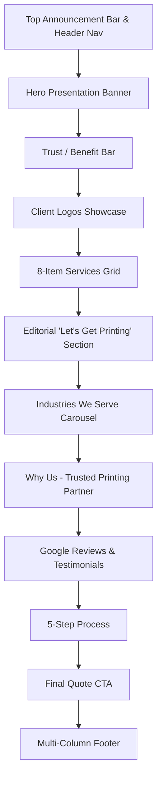

# ☀️ Sunlight Graphics — B2B Commercial Printing & Signage Website

[](https://developer.mozilla.org/en-US/docs/Web/HTML)
[](https://developer.mozilla.org/en-US/docs/Web/CSS)
[](https://developer.mozilla.org/en-US/docs/Web/JavaScript)
[](LICENSE)

A high-performance, modern, B2B-focused web portal developed for **Sunlight Graphics** — Sacramento County’s leading commercial printing and custom signage company located in Loomis, CA.

Built strictly according to the **Official Sunlight Graphics Developer Blueprint**, prioritizing **Quote Request conversions**, clear service offerings, industry solutions, local credibility, and seamless user experience.

---

## ✨ Features & Highlights

- 🎯 **Conversion-Optimized B2B Architecture**: Tailored for business-to-business clients with prominent CTA touchpoints (*Request a Quote*, *Upload Artwork*).
- 🎨 **Official Brand Design System**: Strictly adheres to official brand guidelines — Poppins typography, Sunlight Blue (`#223983`), Sunlight Red (`#C4161C`), and Dark Navy (`#0A1C4D`).
- 📱 **100% Fully Responsive**: Fluid layout scaling effortlessly from ultra-wide desktops down to mobile screens.
- ⚡ **Zero External Heavy Dependencies**: Built with pure HTML5, modern Vanilla CSS, and lightweight Vanilla JavaScript for instant page load times.
- 🎠 **Interactive UI Components**:
  - Dynamic **Industries Carousel** with smooth scroll controls.
  - Interactive **Quote Request Modal** with form validation.
  - Drag-and-Drop **Artwork Upload Modal** supporting high-res vector files up to 250MB.
  - Slide-out **Mobile Navigation Menu** with smooth toggles.
- 🛡️ **Comprehensive Section Hierarchy**:
  1. Top Header & Announcement Bar
  2. Hero Presentation Banner
  3. Trust / Benefit Pillars Bar
  4. Client Logo Showcase (Verizon, T-Mobile, NYC Health, Barclays, Mount Sinai)
  5. 8-Item Core Printing Services Grid
  6. Two-Column Editorial "Let's Get Printing" Brand Callout
  7. Industries We Serve (Interactive Slider)
  8. Trusted Printing Partner Feature (Dark Navy Card + 2x2 Grid)
  9. Google Reviews & Customer Testimonials (4.9 Rating Badge)
  10. 5-Step Streamlined Order Process
  11. Bottom Final CTA Banner with Sacramento City Skyline Overlay
  12. Comprehensive Multi-Column Footer

---

## 🎨 Design System & Palette

| Token Name | Hex Code | Visual Reference | Purpose |
|---|---|---|---|
| **Sunlight Graphics Blue** | `#223983` | `rgb(34, 57, 131)` | Primary Headings, Branding, Main Links |
| **Sunlight Graphics Red** | `#C4161C` | `rgb(196, 22, 28)` | Primary CTAs, Badges, Highlights |
| **Dark Navy** | `#0A1C4D` | `rgb(10, 28, 77)` | Top Bar, Cards, Deep Contrast Sections |
| **Subtle Light Background** | `#F8FAFD` | `rgb(248, 250, 253)` | Section Backgrounds, Card Fills |

---

## 🛠️ Installation & Local Usage

No complex setup or node compilation required! You can view and edit the project directly in your browser.

### Option 1: Direct File Open
Double-click `index.html` or open it in any modern browser (Chrome, Edge, Firefox, Safari).

### Option 2: Local Web Server (Recommended)
Using Python or VS Code Live Server:

```bash
# Using Python 3 built-in HTTP server
python -m http.server 8000
```
Then visit `http://localhost:8000` in your web browser.

---

## 📋 Section Architecture Overview



---

## 📄 License & Attribution

Copyright © 2026 **Sunlight Graphics**. All rights reserved.
Designed & Developed strictly according to the **Developer Blueprint specifications**.
