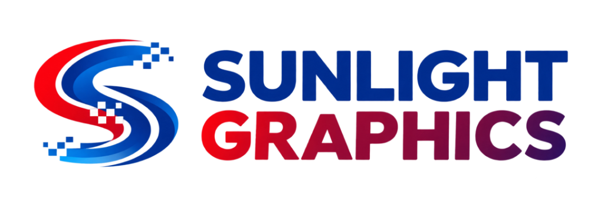

<p align="center">
  
</p>

<h1 align="center">Commercial Printing & Signage Portal</h1>

<p align="center">
  <b>Official Developer Blueprint Implementation</b><br>
  Sacramento County’s Leading Commercial Printing & Signage Partner (Loomis, CA)
</p>

<p align="center">
  <a href="https://developer.mozilla.org/en-US/docs/Web/HTML"></a>
  <a href="https://developer.mozilla.org/en-US/docs/Web/CSS"></a>
  <a href="https://developer.mozilla.org/en-US/docs/Web/JavaScript"></a>
  <a href="#"></a>
</p>

---

## ⚡ Overview

A modern, high-converting B2B web portal engineered for **Sunlight Graphics**. Built strictly to the **Developer Blueprint** specs, prioritizing quote requests, business services, local credibility, and seamless user interaction.

### 🎨 Brand Color Tokens
- 🔵 **Sunlight Blue**: `#223983` — Headings, Branding, Main Links
- 🔴 **Sunlight Red**: `#C4161C` — Primary CTAs, Badges, Highlights
- 🔷 **Dark Navy**: `#0A1C4D` — Top Bar, Containers, Deep Accent Cards
- 🔤 **Typography**: `Poppins` Google Fonts (300–900 weights)

---

## 🛡️ Homepage Section Architecture

1. **Top Bar & Main Nav** — Call `916-421-1200`, Upload Art, Request Quote CTAs.
2. **Hero Presentation Banner** — Approved presentation mockup & value proposition.
3. **Trust Pillars Bar** — Premium Quality, Fast Turnaround, Competitive Pricing, Dedicated Support.
4. **Client Logos Showcase** — Verizon, T-Mobile, NYC Health, Barclays, Mount Sinai.
5. **8-Item Services Grid** — Business Printing, Marketing, Wide Format, Apparel, Booklets, Signs, Direct Mail, Design.
6. **"Let's Get Printing"** — Editorial feature block with red accent bar & dot matrix grid.
7. **Industries We Serve** — Interactive carousel slider with custom arrow navigation.
8. **Why Us (Trusted Partner)** — Dark navy brand card with 2x2 supporting benefit breakdown.
9. **Google Reviews** — 4.9 ★★★★★ rating summary with customer testimonials.
10. **5-Step Process** — Quote → Submit Art → Print Production → Quality Control → Delivery/Pickup.
11. **Final CTA Banner** — Action banner with Sacramento skyline vector overlay.
12. **Multi-Column Footer** — Category menus, contact info, social links, and legal policies.

---

## 💻 Local Quick Start

Open `index.html` directly in any browser, or run via local server:

```bash
# Launch simple HTTP server
python -m http.server 8000
```
Visit `http://localhost:8000` in your web browser.

---

<p align="center">
  <sub>Copyright © 2026 <b>Sunlight Graphics</b>. All rights reserved.</sub>
</p>
